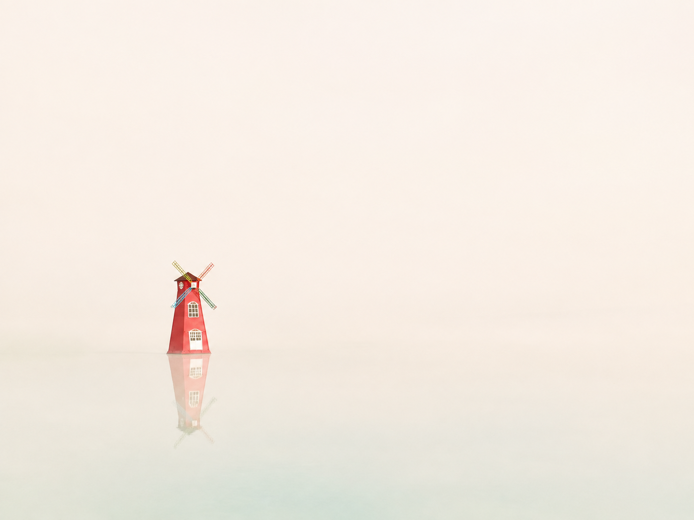
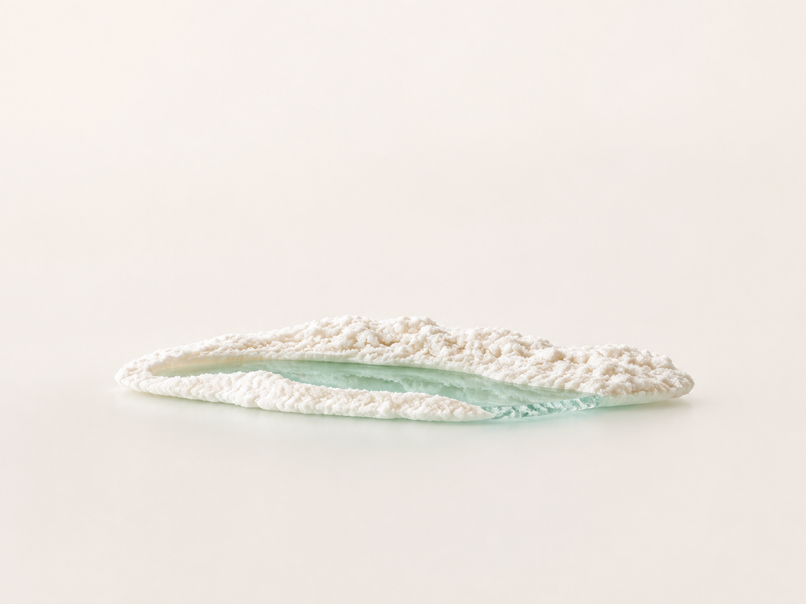
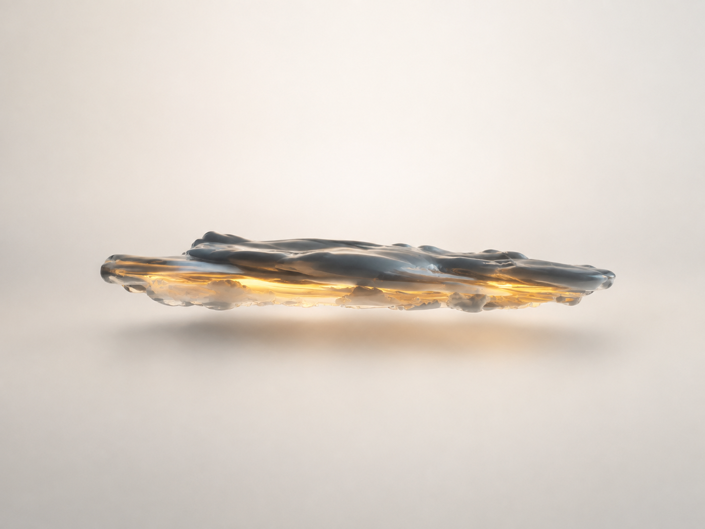

# 抽象留白风景 · Abstract Negative-Space Landscape

一个把风景照片提炼成「单一主体 + 大面积留白」艺术画面的 Codex Skill。

保留原图最有辨识度的主体，让周围环境逐渐消解为暖白、珍珠灰或极浅青色的空间。通过克制的透明材质、柔光和轻微悬浮感，形成安静、简洁且有辨识度的系列。

## 示例

### 风车与倒影



### 盐晶与浅青水体



### 云层与琥珀光隙



以上为风格示例。实际构图会根据上传照片的主体形状调整，不要求每张复制同一位置或材质。

## 安装到 Codex

1. 下载并解压此仓库（Code → Download ZIP）。
2. 将解压后的文件夹命名为 `abstract-negative-space-landscape`。
3. 把整个文件夹放入用户目录下的 `.codex/skills/`。Windows 通常为 `%USERPROFILE%\.codex\skills\abstract-negative-space-landscape\`，macOS/Linux 通常为 `~/.codex/skills/abstract-negative-space-landscape/`。若配置了自定义技能目录，以该目录为准。
4. 确认 `SKILL.md` 直接位于该文件夹内，避免重复嵌套；重新打开 Codex 或新建会话后使用。

## 怎么用

上传照片后直接发送：

```text
使用 $abstract-negative-space-landscape，把这张照片做成抽象留白风格，保留一个最有辨识度的主体，背景暖白，画面安静高级。
```

多图系列：

```text
使用 $abstract-negative-space-landscape，把这几张照片分别做成统一系列，每张单独输出；保留各自的主体，统一背景色温、柔光、留白和材质气质。
```

多版变化：

```text
使用 $abstract-negative-space-landscape，为这张照片做暖象牙白树脂、珍珠灰矿物、浅青雾玻璃三版，保持主体可辨认和大面积留白，每版单独输出。
```

只要提示词：

```text
使用 $abstract-negative-space-landscape，分析这张照片，只给我一段完整可复制的中文图像编辑提示词，包含主体保留要求、留白构图、材质、光影和排除项。
```

也可以补充「更抽象一点」「主体再小一些」「保持原比例」「改为竖版 3:4」等要求。明确要求优先于默认值。

## 默认规则

- 一张画面保留一个主视觉；必要的倒影或相连地形视作主体的一部分。
- 约 70–80% 的视觉区域保持安静，背景带极微弱空间层次。
- 主体保留轮廓、方向、关键结构和标志性色彩；材料抽象服务于辨识度。
- 使用柔和光照和轻微投影；多图统一色温、光向、材质气质和抽象程度。
- 默认沿用原图比例，不添加文字、边框、拼贴、撕纸或装饰符号。

## 文件说明

- [SKILL.md](SKILL.md)：触发条件、操作流程、默认行为及交付要求。
- [风格系统](references/style-system.md)：主体提炼、空间、材质和系列一致性。
- [提示词模板](references/prompt-recipes.md)：单图、批量、三类场景与常见纠偏。
- [质量检查](references/quality-checklist.md)：生成后逐项视觉检查。
- `agents/openai.yaml`：Codex 界面名称与默认调用语句。
- `assets/examples/`：三张风格示例图。

## 运行条件与边界

这是工作流与风格指导文件，不包含图像模型、API 密钥或独立生成程序。输出图片需要当前工具环境具备图像生成或编辑能力；没有可用图像工具时，可以用它生成完整提示词。文件格式校验不代表每次生成都能完全复现示例，成品仍需视觉检查。

请使用你有权处理和分享的输入素材。示例图片用于展示本 Skill 的视觉方向。
